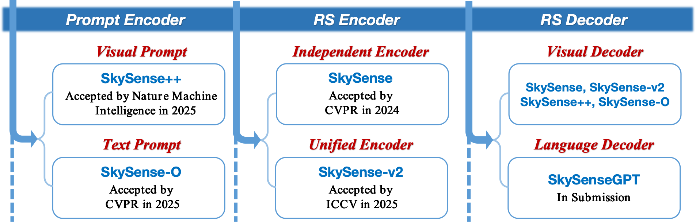

<div align="center" style="margin-bottom: 40px;">
  
</div>

<div align=center>

[](https://openaccess.thecvf.com/content/CVPR2025/papers/Zhu_SkySense-O_Towards_Open-World_Remote_Sensing_Interpretation_with_Vision-Centric_Visual-Language_Modeling_CVPR_2025_paper.pdf) 
[](https://huggingface.co/zqcraft/SkySense-O/tree/main) 
[](https://huggingface.co/zqcraft/SkySense-O/tree/main) 
[](demo/readme.md)

</div>


## Introduction✨


### 1. SkySense Family

Welcome to SkySense-O — part of the SkySense family [[homepage]](https://zqcrafts.github.io/SkySense-O/project.html), a series of remote sensing foundation models for earth observation as following. We'd be delighted to have your attention and earn a star!  
<sub>[(1) SkySense: A Multi-Modal Remote Sensing Foundation Model Towards Universal Interpretation for Earth Observation Imagery](https://arxiv.org/pdf/2312.10115)</sub>  
<sub>[(2) SkySense-O: Towards Open-World Remote Sensing Interpretation with Vision-Centric Visual-Language Modeling](https://github.com/zqcrafts/SkySense-O)</sub>  
<sub>[(3) SkySense-V2: A Unified Foundation Model for Multi-modal Remote Sensing](https://arxiv.org/pdf/2507.13812)</sub>  
<sub>[(4) SkySense++: A Semantic-Enhanced Multi-Modal Remote Sensing Foundation Model for Earth Observation](https://www.nature.com/articles/s42256-025-01078-8)</sub>  
<sub>[(5) SkySenseGPT: A Fine-Grained Instruction Tuning Dataset and Model for Remote Sensing Vision-Language Understanding](https://arxiv.org/pdf/2406.10100)</sub>  

<div align="center">
    
</div>

### 2. SkySense-O

This is a model aggregated with CLIP and SAM version of SkySense for remote sensing interpretation described in [SkySense-O: Towards Open-World Remote Sensing Interpretation with Vision-Centric Visual-Language Modeling](https://openaccess.thecvf.com/content/CVPR2025/papers/Zhu_SkySense-O_Towards_Open-World_Remote_Sensing_Interpretation_with_Vision-Centric_Visual-Language_Modeling_CVPR_2025_paper.pdf). In addition to introducing <strong>a powerful remote sensing vision-language foundation model</strong>, we have also proposed <strong>the first open-vocabulary segmentation dataset</strong> in the remote sensing domain. Each ground truth (contains mask and text) in the dataset has undergone multiple rounds of <strong>annotation and validation by human experts</strong>, enabling the capability to <strong style="color:red">segment anything in open remote sensing scenarios</strong>.
<!-- >Open-world interpretation aims to accurately localize and recognize all objects within images by vision-language models (VLMs). While substantial progress has been made in this task for natural images, the advancements for remote sensing (RS) images still remain limited, primarily due to these two challenges.1) Existing RS semantic categories are limited, particularly for pixel-level interpretation datasets.2) Distinguishing among diverse RS spatial regions solely by language space is challenging due to the dense and intricate spatial distribution in open-world RS imagery. To address the first issue, we develop a fine-grained RS interpretation dataset, Sky-SA, which contains 183,375 high-quality local image-text pairs with full-pixel manual annotations, covering 1,763 category labels, exhibiting richer semantics and higher density than previous datasets.Afterwards, to solve the second issue, we introduce the vision-centric principle for vision-language modeling. Specifically, in the pre-training stage, the visual self-supervised paradigm is incorporated into image-text alignment, reducing the degradation of general visual representation capabilities of existing paradigms. Then, we construct a visual-relevance knowledge graph across open-category texts and further develop a novel vision-centric image-text contrastive loss for fine-tuning with text prompts.This new model, denoted as SkySense-O, demonstrates impressive zero-shot capabilities on a thorough evaluation encompassing 14 datasets over 4 tasks, from recognizing to reasoning and classification to localization. Specifically, it outperforms the latest models such as SegEarth-OV, GeoRSCLIP, and VHM by a large margin, i.e., 11.95\%, 8.04\% and 3.55\% on average respectively. -->

<!-- <div>
    <strong style="color: red; font-size: 18px;"> "CLIP and SAM Version of SkySense for Remote Sensing Anything" </strong>
</div> -->


The primary advantage of our model, <strong style="color:red">in comparison to [SAM](https://segment-anything.com/demo) and [GroundingDINO](https://github.com/IDEA-Research/GroundingDINO)</strong>, lies in its ability to deliver output with pixel-level spatial high density and more expansive semantic labeling as following.

<!-- <div>
    <strong style="color: red; font-size: 18px;"> "Comparison of Sky-SA and other datasets" </strong>
</div> -->

<div align="center">
    
</div>


## News 🚀
- `2025/02/27`: 🔥 SkySense-O has been accepted to <strong>CVPR2025</strong> !
- `2025/04/08`: 🔥 We introduce <strong>SkySense-O</strong>, demonstrating impressive zero-shot capabilities on a thorough evaluation encompassing 14 datasets, from recognizing to reasoning and classification to localization. Specifically, it outperforms the latest models such as SegEarth-OV, GeoRSCLIP, and VHM by a large margin, i.e., <strong>11.95\%, 8.04\% and 3.55\%</strong> on average respectively.
- `2025/06/10`: 🔥 We release the training and evaluation code.
- `2025/06/11`: 🔥 We release the checkpoints and demo. Welcome to try!
- `2025/06/17`: 🔥 We release the checkpoints of SkySense-CLIP[[ckpt]](https://huggingface.co/zqcraft/SkySense-O/tree/main) for future research.
- `2025/06/29`: 🔥 We release the Sky-SA dataset[[dataset]](https://huggingface.co/zqcraft/SkySense-O/tree/main) .
- `2025/08/06`: 🔥 Our new work, <strong>SkySense++</strong>[[paper]](https://www.nature.com/articles/s42256-025-01078-8)[[code]](https://github.com/kang-wu/SkySensePlusPlus), has been accepted to Nature Machine Intelligence! Different from text prompt of Skysense-O,  SkySense++ focuses on visual prompt.
- `2025/08/08`: 🔥 The SkySense family [homepage](https://zqcrafts.github.io/SkySense-O/project.html) is now live. Welcome to follow us!


## Try Our Demo 🕹️
1. Install dependencies.
2. Download the demo checkpoint. [[ckpt]](https://huggingface.co/zqcraft/SkySense-O/tree/main)
3. Run the demo according to the demo guide. [[docs]](demo/readme.md)

## Dependencies and Installation

##### 1. install detectron2
```
python -m pip install 'git+https://github.com/MaureenZOU/detectron2-xyz.git'
```
##### 2. clone this repository and install dependencies
```
git clone https://github.com/zqcraft/SkySense-O.git
cd SkySense-O
pip install -r require.txt
pip install accelerate -U
```

## Dataset Preparation

- Sky-SA dataset 🤗 [download](https://huggingface.co/zqcraft/SkySense-O/tree/main)

After downloading Sky-SA dataset, organize the data as follows in `./data`,
```
├── Sky-SA
│   ├── img_dir
│   ├── ann_dir
│   ├── skysa_dataset.jsonl
│   ├── skysa_graph.jsonl
```


## Model Training and Evaluation
```
sh run_train.sh 
```
To evaluate only, modify the script as follows: add `--eval-only` to the command in `run_train.sh`. The line should read: `python train_net.py --eval-only`.
Then execute above command.

## Results

<div align="center">

</div>

## Citation

```
@InProceedings{Zhu_2025_CVPR,
    author    = {Zhu, Qi and Lao, Jiangwei and Ji, Deyi and Luo, Junwei and Wu, Kang and Zhang, Yingying and Ru, Lixiang and Wang, Jian and Chen, Jingdong and Yang, Ming and Liu, Dong and Zhao, Feng},
    title     = {SkySense-O: Towards Open-World Remote Sensing Interpretation with Vision-Centric Visual-Language Modeling},
    booktitle = {Proceedings of the Computer Vision and Pattern Recognition Conference (CVPR)},
    month     = {June},
    year      = {2025},
    pages     = {14733-14744}
}

@article{wu2025semantic,
  author       = {Wu, Kang and Zhang, Yingying and Ru, Lixiang and Dang, Bo and Lao, Jiangwei and Yu, Lei and Luo, Junwei and Zhu, Zifan and Sun, Yue and Zhang, Jiahao and Zhu, Qi and Wang, Jian and Yang, Ming and Chen, Jingdong and Zhang, Yongjun and Li, Yansheng},
  title        = {A semantic‑enhanced multi‑modal remote sensing foundation model for Earth observation},
  journal      = {Nature Machine Intelligence},
  year         = {2025},
  doi          = {10.1038/s42256-025-01078-8},
  url          = {https://doi.org/10.1038/s42256-025-01078-8}
}

@inproceedings{guo2024skysense,
    author    = {Guo, Xin and Lao, Jiangwei and Dang, Bo and Zhang, Yingying and Yu, Lei and Ru, Lixiang and Zhong, Liheng and Huang, Ziyuan and Wu, Kang and Hu, Dingxiang and He, Huimei and Wang, Jian and Chen, Jingdong and Yang, Ming and Zhang, Yongjun and Li, Yansheng},
    title     = {SkySense: A Multi-Modal Remote Sensing Foundation Model Towards Universal Interpretation for Earth Observation Imagery},
    booktitle = {Proceedings of the IEEE/CVF Conference on Computer Vision and Pattern Recognition (CVPR)},
    month     = {June},
    year      = {2024},
    pages     = {27672-27683}
}

@article{luo2024skysensegpt,
  title={Skysensegpt: A fine-grained instruction tuning dataset and model for remote sensing vision-language understanding},
  author={Luo, Junwei and Pang, Zhen and Zhang, Yongjun and Wang, Tingzhu and Wang, Linlin and Dang, Bo and Lao, Jiangwei and Wang, Jian and Chen, Jingdong and Tan, Yihua and others},
  journal={arXiv preprint arXiv:2406.10100},
  year={2024}
}
```

## Acknowledgement
This implementation is based on [Detectron 2](https://github.com/facebookresearch/detectron2). Thanks for the awesome work.
