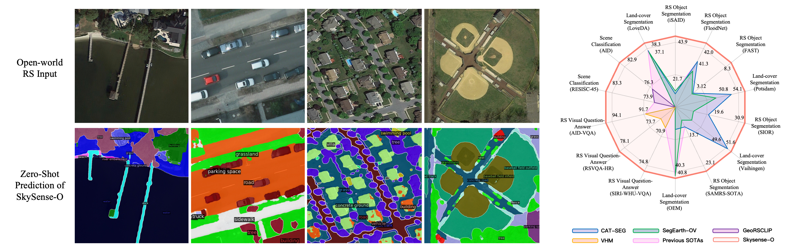
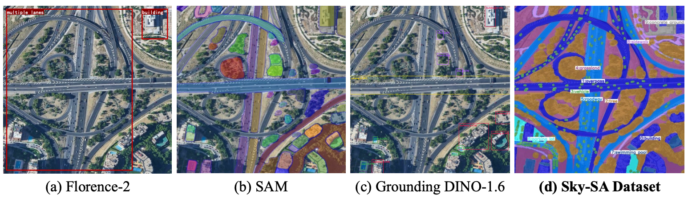
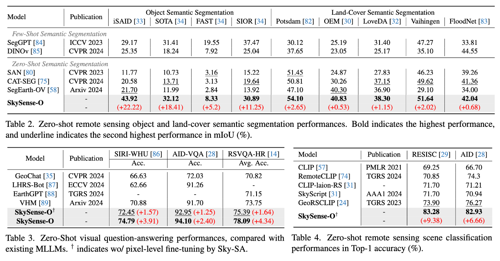

<div align="center" style="margin-bottom: 40px;">
  
</div>


<div style="position: relative; text-align: center;">
  <div style="position: absolute; top: 0; left: 50%; transform: translateX(-50%); width: 100%; height: 0; border-top: 4px dashed gray; z-index: 10;"></div>
</div>

<!-- <div style="position: relative; text-align: center;"> <div style="position: absolute; top: 0; left: 50%; transform: translateX(-50%); width: 100%; height: 4px; background-color: gray; z-index: 10;"></div> </div>  -->


<!-- <h3>✨ In CVPR 2025 <a href="https://arxiv.org/abs/2410.01768" target='_blank'>[arXiv]</a>  ✨</h3> -->

### SkySense-O: Towards Open-World Remote Sensing Interpretation with Vision-Centric Visual-Language Modeling  <a href="https://openaccess.thecvf.com/content/CVPR2025/papers/Zhu_SkySense-O_Towards_Open-World_Remote_Sensing_Interpretation_with_Vision-Centric_Visual-Language_Modeling_CVPR_2025_paper.pdf" target='_blank'>[Paper]</a> 


</div>

[](https://paperswithcode.com/sota/open-vocabulary-semantic-segmentation-on-15?p=skysense-a-multi-modal-remote-sensing)  [](https://paperswithcode.com/sota/open-vocabulary-semantic-segmentation-on-fast?p=skysense-a-multi-modal-remote-sensing)  
[](https://paperswithcode.com/sota/open-vocabulary-semantic-segmentation-on-16?p=skysense-a-multi-modal-remote-sensing)  [](https://paperswithcode.com/sota/open-vocabulary-semantic-segmentation-on-sior?p=skysense-a-multi-modal-remote-sensing)  
[](https://paperswithcode.com/sota/open-vocabulary-semantic-segmentation-on-sota?p=skysense-a-multi-modal-remote-sensing)  [](https://paperswithcode.com/sota/visual-question-answering-on-siri-whu?p=skysense-a-multi-modal-remote-sensing)  
[](https://paperswithcode.com/sota/visual-question-answering-on-aid-vqa?p=skysense-a-multi-modal-remote-sensing)  [](https://paperswithcode.com/sota/visual-question-answering-on-rsvqa-hr?p=skysense-a-multi-modal-remote-sensing)  
[](https://paperswithcode.com/sota/zero-shot-classification-unified-classes-on-2?p=skysense-a-multi-modal-remote-sensing)  [](https://paperswithcode.com/sota/zero-shot-classification-unified-classes-on-3?p=skysense-a-multi-modal-remote-sensing)  
<!-- [](https://arxiv.org/abs/2312.14033)  [](./LICENSE) -->


<div align="left">

## Introduction✨

This is a model aggregated with CLIP and SAM version of SkySense for remote sensing interpretation described in [SkySense-O: Towards Open-World Remote Sensing Interpretation with Vision-Centric Visual-Language Modeling](https://openaccess.thecvf.com/content/CVPR2025/papers/Zhu_SkySense-O_Towards_Open-World_Remote_Sensing_Interpretation_with_Vision-Centric_Visual-Language_Modeling_CVPR_2025_paper.pdf). In addition to introducing <strong>a powerful remote sensing vision-language foundation model</strong>, we have also proposed <strong>the first open-vocabulary segmentation dataset</strong> in the remote sensing domain. Each ground truth (contains mask and text) in the dataset has undergone multiple rounds of <strong>annotation and validation by human experts</strong>, enabling the capability to <strong style="color:red">segment anything in open remote sensing scenarios</strong>.
<!-- >Open-world interpretation aims to accurately localize and recognize all objects within images by vision-language models (VLMs). While substantial progress has been made in this task for natural images, the advancements for remote sensing (RS) images still remain limited, primarily due to these two challenges.1) Existing RS semantic categories are limited, particularly for pixel-level interpretation datasets.2) Distinguishing among diverse RS spatial regions solely by language space is challenging due to the dense and intricate spatial distribution in open-world RS imagery. To address the first issue, we develop a fine-grained RS interpretation dataset, Sky-SA, which contains 183,375 high-quality local image-text pairs with full-pixel manual annotations, covering 1,763 category labels, exhibiting richer semantics and higher density than previous datasets.Afterwards, to solve the second issue, we introduce the vision-centric principle for vision-language modeling. Specifically, in the pre-training stage, the visual self-supervised paradigm is incorporated into image-text alignment, reducing the degradation of general visual representation capabilities of existing paradigms. Then, we construct a visual-relevance knowledge graph across open-category texts and further develop a novel vision-centric image-text contrastive loss for fine-tuning with text prompts.This new model, denoted as SkySense-O, demonstrates impressive zero-shot capabilities on a thorough evaluation encompassing 14 datasets over 4 tasks, from recognizing to reasoning and classification to localization. Specifically, it outperforms the latest models such as SegEarth-OV, GeoRSCLIP, and VHM by a large margin, i.e., 11.95\%, 8.04\% and 3.55\% on average respectively. -->

<!-- <div>
    <strong style="color: red; font-size: 18px;"> "CLIP and SAM Version of SkySense for Remote Sensing Anything" </strong>
</div> -->



The primary advantage of our model, <strong style="color:red">in comparison to [SAM](https://segment-anything.com/demo) and [GroundingDINO](https://github.com/IDEA-Research/GroundingDINO)</strong>, lies in its ability to deliver output with pixel-level spatial high density and more expansive semantic labeling as following.

<!-- <div>
    <strong style="color: red; font-size: 18px;"> "Comparison of Sky-SA and other datasets" </strong>
</div> -->




## News 🚀
- `2025/02/27`: 🔥 SkySense-O has been accepted to <strong>CVPR2025</strong> !
- `2025/04/08`: 🔥 We introduce <strong>SkySense-O</strong>, demonstrating impressive zero-shot capabilities on a thorough evaluation encompassing 14 datasets, from recognizing to reasoning and classification to localization. Specifically, it outperforms the latest models such as SegEarth-OV, GeoRSCLIP, and VHM by a large margin, i.e., <strong>11.95\%, 8.04\% and 3.55\%</strong> on average respectively.
- `2025/06/10`: 🔥 We release the training and evaluation code.
- `2025/06/11`: 🔥 We release the checkpoints and demo. Welcome to try!

## TODO 📝
- [ ] Release the Sky-SA dataset. (before 6.22)
- [ ] Release the code for data engine. (before 6.22)

## Try Our Demo 🕹️
1. Install dependencies.
2. Download the demo checkpoint. [[ckpt]](https://huggingface.co/zqcraft/SkySense-O/tree/main)
3. Run the demo according to the demo guide. [[docs]](demo/readme.md)

## Dependencies and Installation

##### 1. install detectron2
```
python -m pip install 'git+https://github.com/MaureenZOU/detectron2-xyz.git'
```
##### 2. clone this repository and install dependencies
```
git clone https://github.com/zqcraft/SkySense-O.git
cd SkySense-O
pip install -r require.txt
pip install accelerate -U
```

## Model Training and Evaluation
```
sh run_train.sh 
```
To evaluate only, modify the script as follows: add `--eval-only` to the command in `run_train.sh`. The line should read: `python train_net.py --eval-only`.
Then execute above command.

## Results

<div align="center">

</div>

## Citation

```
@article{zhu2025skysenseo,
  title={SkySense-O: Towards Open-World Remote Sensing Interpretation with Vision-Centric Visual-Language Modeling},
  author={Qi Zhu, Jiangwei Lao, Deyi Ji, Junwei Luo, Kang Wu, Yingying Zhang, Lixiang Ru, Jian Wang, Jingdong Chen, Ming Yang, Dong Liu, Feng Zhao},
  journal={IEEE Conference on Computer Vision and Pattern Recognition},
  year={2025}
}
```

## Acknowledgement
This implementation is based on [Detectron 2](https://github.com/facebookresearch/detectron2). Thanks for the awesome work.
